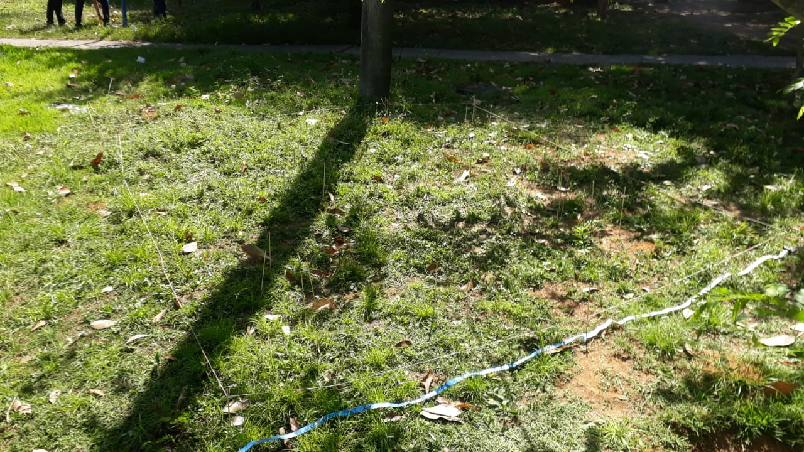

# Objetivo

O objetivo deste trabalho consiste em verificar a presença de algum padrão espacial em dados coletados na UFBA. 


# Materiais e Métodos

Inicialmente foram gerados 300 pares aleatórios de pontos no software R, e destes foram selecionados 50 pontos com suas respectivas coordenadas. 
O grid foi medido com uma área de 9 metros quadrados próximo a portaria 1 e estacionamento da Universidade Federal da Bahia, campus Ondina, 
e os 50 pontos gerados foram marcados dentro da área delimitada. Para delimitar a área foram utilizados barbante, palito de churrasco e fita métrica. 

Os pontos gerados no R foram:


```{r, echo=FALSE,message=FALSE,error=FALSE,warning=FALSE}


require(geoR)

###################################
#Gerando Pontos
#install.packages("geoR")
#?s100
set.seed(5)
x=sample(1:300,replace = F)
set.seed(156)
y=sample(1:300,replace = F)
#?sample
#plot(x,y)  #pontos
dados <- data.frame(x=x,y=y)

###########################################
#interessante colocar foto da nossa coleta
dados$grupo=NULL
dados$grupo[1:50] <- "selecionado"

dados$grupo[51:300] <- "n_selecionado"

plot(x=dados$x,y=dados$y,pch="o",col=as.factor(dados$grupo),xlab="latitude",ylab="longitude",main="Pontos selecionados em Vermelho")


```

A medida em que as informações eram coletadas em cada ponto, um palito de churrasco era colocado neste ponto. 
Para cada um deles foram coletadas a altura da planta em centímetros, a presença de flor, número de folhas e número de pétalas. 
Caso a planta não apresentasse flor, era atribuído 0 para a presença de flor e número de pétalas.

Area experimental:


Se não houvesse planta no ponto indicado, 
a planta mais próxima era considerada. Um dos pontos não continha planta e nem plantas nas proximidades, 
e análise foi prosseguida com os outros 49.    

# Análise descritiva

A altura média das plantas é 9.3cm, o número médio de folhas é 9.26, e das 49 plantas analisadas 11 apresentaram flor. 
Dentre as que continham flor, o número médio de pétalas foi de 2.6.

Primeiramente para verificar algum tipo de padrão na altura e número de folhas ou pétalas, seguimos com os gráficos de dispersão:

VER A RELAÇÃO FOLHA~ALTURA (existe correlação positiva), o teste de correlação indica que temos evidência para rejeitar a hipótese que a verdadeira correlação é 0

```{r, echo=FALSE,message=FALSE,error=FALSE,warning=FALSE}

#base de dados
dados_nosso <- data.frame(lat=dados$x[1:50],long=dados$y[1:50])
dados_nosso$folhas <- c(26,4,6,1,6,22,15,6,6,15,12,12,5,6,33,64,2,2,9,6,6,7,8,9,7,17,4,6,8,1,10,6,9,9,4,4,3,2,5,5,4,6,2,NA,12,8,4,5,18,7)
dados_nosso$petalas <- c(0,0,0,0,0,0,4,16,5,0,0,0,0,4,0,0,0,0,16,3,0,0,0,0,0,0,0,0,0,0,5,0,16,0,0,0,5,0,0,0,0,0,0,NA,12,8,4,5,18,7)
dados_nosso$flor <- c(0,0,0,0,0,0,1,1,1,0,0,0,0,1,0,0,0,0,1,1,0,0,0,0,0,0,0,0,0,0,1,0,1,0,0,0,1,0,0,0,0,0,0,NA,0,1,1,0,0,0)
dados_nosso$altura <- c(21,0,2,1,0,8,25,15,17,5,4,10,2,13.5,35.5,28,2,2,18.75,12.5,7,6.5,2,2.5,9.5,5,2,1,22.5,0,22,5.5,21.5,5,2,14.5,10,2,5,4,0,1,2,NA,16,16,13,2.5,22.5,12)

dados_nosso <- na.omit(dados_nosso)

#correlção entre altura e folhas, correlação entre altura e petalas
cor.test(dados_nosso$altura,dados_nosso$folhas,method = "spearman")

plot(dados_nosso$altura,dados_nosso$folhas,main="Dispersão Altura e Folhas",xlab="Altura",ylab="Folhas")


```

VER A RELAÇÃO PETALA~ALTURA (existe correlação positiva), o teste de correlação indica que temos evidência para rejeitar a hipótese que a verdadeira correlação é 0

```{r, echo=FALSE,message=FALSE,error=FALSE,warning=FALSE}

plot(dados_nosso$altura,dados_nosso$petalas,main="Dispersão Altura e Pétalas",xlab="Altura",ylab="Pétalas")

cor.test(dados_nosso$altura,dados_nosso$petalas,method = "spearman")


```


COMO NÃO SÃO NORMAIS, TEM QUE FAZER A CORRELAÇÃO DE SPERMAN
o teste é bilateral pq não temos uma informação a priori. Os resultados do teste de normalidade Shapiro-Wilk abaixo são respectivamente para a altura, número de folhas e número de pétalas:

```{r, echo=FALSE,message=FALSE,error=FALSE,warning=FALSE}

shapiro.test(dados_nosso$altura)
shapiro.test(dados_nosso$folhas)
shapiro.test(dados_nosso$petalas)

```

Todos os testes foram rejeitados a um nível de 5%, portanto temos evidência de que a distribuição destas variáveis não é normal.

## Teste de Aleatorização de Mantel

Caso os dados não sejam normais, não é possível realizar o semi variograma. Neste caso, nas próximas seções vamos para o teste de aleatorização de Mantel, o número de simulações Monte-Carlo foi de 10 000, o h0 do teste diz que o padrão espacial é aleatório, a hipótese alternativa h1 diz que o padrão espacial não é aleatório. 

## Análise do padrão para Altura

Pela figura abaixo, vemos anisotropia em x, porem o mesmo não é identificado em y, apesar de haver uma concentração de cores quentes (vermelho e amarelo) no primeiro gráfico, realizando essa análise a sentimento parece haver padrão, mas caso haja pode ser muito fraco.

```{r, echo=FALSE,message=FALSE,error=FALSE,warning=FALSE}

#######################################################################
require(geoR)
dados <- dados_nosso
#plot(dados)
dadosgeo=as.geodata(dados, coords.col = 1:2, data.col = 6)
#Avaliando Altura
#plot(dadosgeo)

require(MASS)
bor <- dadosgeo$coords[chull(dadosgeo$coords),]
dadosgeo$borders <- bor
plot(dadosgeo)

```

O gráfico de distribuição dos pontos mostra que existe uma concentração de plantas com altura alta no canto superior esquerdo e uma concentração de plantas com altura baixa no canto inferior direito, no entanto, reforçando a idéia de que haja algum tipo de padrão.

```{r, echo=FALSE,message=FALSE,error=FALSE,warning=FALSE}

points(dadosgeo,main="Distribuição dos Pontos Para Altura",xlab="Latitude",ylab="Longitude")

```

Realizando o Teste de Mantel (o resultado indica padrão aleatório), não temos evidencia a um nível de 5% de significância para rejeitar a hipótese de que o padrão é aleatório.


```{r, echo=FALSE,message=FALSE,error=FALSE,warning=FALSE}

#h0: padrão é aleatório
#h1: padrão não é aleatório

x=dados$lat
y=dados$long
z=dados$altura
n=length(x)

sim=dadosgeo


# Matriz L: matriz dos pontos (xi,yi)
L=matrix(c(x,y), n, 2)


# Calcular n (n�mero de pares (xi,yi)): ordem da matriz sim�trica A (matriz
# das dist�ncias das localiza��es)

n=nrow(L)


# Antes de encontrar a matriz A, cria-se uma matriz nula A

A=matrix(c(rep(0)),n,n)
# dependendo da vers�o do R, pode ser A=matrix(c(0),n,n)

for (i in 1:n) {
  for (j in 1:n) {
    if (i==j) {
      A[i,j]=0 }
    else {
      A[i,j]=sqrt((L[i,1]-L[j,1])^2+(L[i,2]-L[j,2])^2) }
  } }


# Matriz B: matriz das dist�ncias entre as repostas

# Matriz Z: cont�m as respostas

Z=matrix(c(z),n,1)


# Calcula-se m (n�mero de observa��es de Z): ordem da matriz sim�trica B

m=nrow(Z)


# Como em A, antes de encontrar a matriz B, cria-se uma matriz nula B

B=matrix(c(rep(0)),m,m)
# dependendo da vers�o do R, pode ser B=matrix(c(0), m,m)

for (i in 1:m) {
  for (j in 1:m) {
    if (i==j) {
      B[i,j]=0 }
    else {
      B[i,j]=sqrt((Z[i,1]-Z[j,1])^2) }
  } }


A1=matrix(c(A),n,1)
B1=matrix(c(B),m,1)

# Teste de Mantel

proc=function(q){
  # Lendo os dados
  
  aux=NULL
  # Teste de aleatoriza��o
  for (i in 1:q){
    A1.al=sample(A1)
    correlAl=cor(A1.al,B1, method="pearson")  
    if (abs(correlAl)>=abs(cor(A1,B1, method="pearson")))
      aux[i]=1
    else aux[i]=0
  }
  pvalor=mean(aux)
  #pvalor
  
}

paste("P-valor =",proc(10000))

```


## Análise do padrão para a quantidade de pétalas

Pela figura abaixo, não parece haver anisotropia em x, nem em y, temos apenas uma concentração de cores frias (azul e verde) no primeiro gráfico, realizando essa análise a sentimento parece não haver padrão espacial.


```{r, echo=FALSE,message=FALSE,error=FALSE,warning=FALSE}

#######################################################################
require(geoR)
dados <- dados_nosso
#plot(dados)
dadosgeo=as.geodata(dados, coords.col = 1:2, data.col = 4)
#Avaliando petalas
#plot(dadosgeo)

require(MASS)
bor <- dadosgeo$coords[chull(dadosgeo$coords),]
dadosgeo$borders <- bor
plot(dadosgeo)

```

O gráfico de pontos também parece não indicar nenhuma tendência de padrão espacial não aleatório na quantidade de pétalas.

```{r, echo=FALSE,message=FALSE,error=FALSE,warning=FALSE}

points(dadosgeo,main="Distribuição dos Pontos Para Pétalas",xlab="Latitude",ylab="Longitude")

```

Realizando o Teste de Mantel (o resultado indica padrão aleatório), não temos evidencia a um nível de 5% de significância para rejeitar a hipótese de que o padrão é aleatório.


```{r, echo=FALSE,message=FALSE,error=FALSE,warning=FALSE}

#h0: padrão é aleatório
#h1: padrão não é aleatório

x=dados$lat
y=dados$long
z=dados$petalas
n=length(x)

sim=dadosgeo


# Matriz L: matriz dos pontos (xi,yi)
L=matrix(c(x,y), n, 2)


# Calcular n (n�mero de pares (xi,yi)): ordem da matriz sim�trica A (matriz
# das dist�ncias das localiza��es)

n=nrow(L)


# Antes de encontrar a matriz A, cria-se uma matriz nula A

A=matrix(c(rep(0)),n,n)
# dependendo da vers�o do R, pode ser A=matrix(c(0),n,n)

for (i in 1:n) {
  for (j in 1:n) {
    if (i==j) {
      A[i,j]=0 }
    else {
      A[i,j]=sqrt((L[i,1]-L[j,1])^2+(L[i,2]-L[j,2])^2) }
  } }


# Matriz B: matriz das dist�ncias entre as repostas

# Matriz Z: cont�m as respostas

Z=matrix(c(z),n,1)


# Calcula-se m (n�mero de observa��es de Z): ordem da matriz sim�trica B

m=nrow(Z)


# Como em A, antes de encontrar a matriz B, cria-se uma matriz nula B

B=matrix(c(rep(0)),m,m)
# dependendo da vers�o do R, pode ser B=matrix(c(0), m,m)

for (i in 1:m) {
  for (j in 1:m) {
    if (i==j) {
      B[i,j]=0 }
    else {
      B[i,j]=sqrt((Z[i,1]-Z[j,1])^2) }
  } }


A1=matrix(c(A),n,1)
B1=matrix(c(B),m,1)

# Teste de Mantel

proc=function(q){
  # Lendo os dados
  
  aux=NULL
  # Teste de aleatoriza��o
  for (i in 1:q){
    A1.al=sample(A1)
    correlAl=cor(A1.al,B1, method="pearson")  
    if (abs(correlAl)>=abs(cor(A1,B1, method="pearson")))
      aux[i]=1
    else aux[i]=0
  }
  pvalor=mean(aux)
  #pvalor
  
}

paste("P-valor =",proc(10000))

```


## Análise do padrão para o número de folhas

Pela figura abaixo, vemos anisotropia em x, porem o mesmo não é identificado em y, no primeiro gráfico é possível ver uma concentração de cores frias no canto inferior direito, enquanto no canto inferior esquerdo existe a concentração de cores quentes, no canto superior esquerdo e no meio do gráfico existe a concentração de cores quentes (amarelo e vermelho). Realizando essa análise a sentimento, considerando a anisotropia em x e o gráfico de cores quentes e frias parece haver indicativo de padrão espacial não aleatório.


```{r, echo=FALSE,message=FALSE,error=FALSE,warning=FALSE}

#######################################################################
require(geoR)
dados <- dados_nosso
#plot(dados)
dadosgeo=as.geodata(dados, coords.col = 1:2, data.col = 3)
#Avaliando folhas
#plot(dadosgeo)

require(MASS)
bor <- dadosgeo$coords[chull(dadosgeo$coords),]
dadosgeo$borders <- bor
plot(dadosgeo)

```

O gráfico da distribuição dos pontos mostra a concentração de pontos de tamanho pequeno em diversas localizações, enquanto os pontos de tamanho médio e grande parecem estar mais dispersos pelo gráfico.

```{r, echo=FALSE,message=FALSE,error=FALSE,warning=FALSE}

points(dadosgeo,main="Distribuição dos Pontos nas Folhas",xlab="Latitude",ylab="Longitude")

```

Realizando o Teste de Mantel (o resultado indica padrão aleatório), não temos evidencia a um nível de 5% de significância para rejeitar a hipótese de que o padrão é aleatório.


```{r, echo=FALSE,message=FALSE,error=FALSE,warning=FALSE}

#h0: padrão é aleatório
#h1: padrão não é aleatório

x=dados$lat
y=dados$long
z=dados$folhas
n=length(x)

sim=dadosgeo


# Matriz L: matriz dos pontos (xi,yi)
L=matrix(c(x,y), n, 2)


# Calcular n (n�mero de pares (xi,yi)): ordem da matriz sim�trica A (matriz
# das dist�ncias das localiza��es)

n=nrow(L)


# Antes de encontrar a matriz A, cria-se uma matriz nula A

A=matrix(c(rep(0)),n,n)
# dependendo da vers�o do R, pode ser A=matrix(c(0),n,n)

for (i in 1:n) {
  for (j in 1:n) {
    if (i==j) {
      A[i,j]=0 }
    else {
      A[i,j]=sqrt((L[i,1]-L[j,1])^2+(L[i,2]-L[j,2])^2) }
  } }


# Matriz B: matriz das dist�ncias entre as repostas

# Matriz Z: cont�m as respostas

Z=matrix(c(z),n,1)


# Calcula-se m (n�mero de observa��es de Z): ordem da matriz sim�trica B

m=nrow(Z)


# Como em A, antes de encontrar a matriz B, cria-se uma matriz nula B

B=matrix(c(rep(0)),m,m)
# dependendo da vers�o do R, pode ser B=matrix(c(0), m,m)

for (i in 1:m) {
  for (j in 1:m) {
    if (i==j) {
      B[i,j]=0 }
    else {
      B[i,j]=sqrt((Z[i,1]-Z[j,1])^2) }
  } }


A1=matrix(c(A),n,1)
B1=matrix(c(B),m,1)

# Teste de Mantel

proc=function(q){
  # Lendo os dados
  
  aux=NULL
  # Teste de aleatoriza��o
  for (i in 1:q){
    A1.al=sample(A1)
    correlAl=cor(A1.al,B1, method="pearson")  
    if (abs(correlAl)>=abs(cor(A1,B1, method="pearson")))
      aux[i]=1
    else aux[i]=0
  }
  pvalor=mean(aux)
  #pvalor
  
}

paste("P-valor =",proc(10000))

```


# Conclusão

Não encontramos padrão espacial a um nível de 5% de significância, no entanto a probabilidade de se cometer o erro do tipo 1 ao rejeitar a hipótese de que o padrão espacial é aleatório para a quantidade de folhas é de 8%. Talvez uma adaptação no método de coleta de dados, ou a coleta de mais pontos poderia ajudar a identificar algum padrão na quantidade de folhas das plantas.


